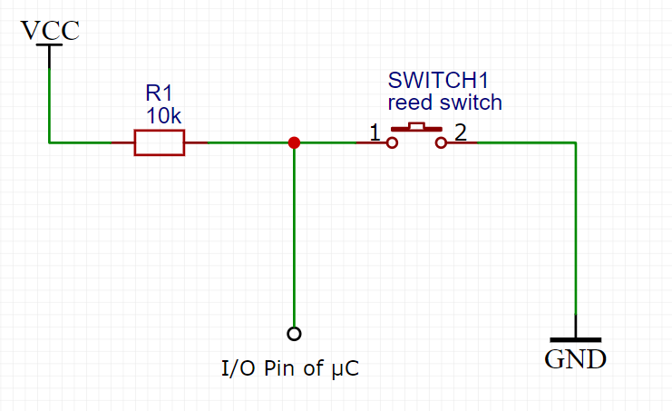
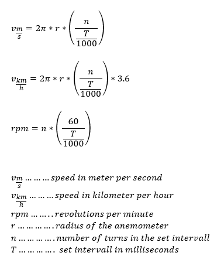

# Windspeed-library

This simple library is made to simply get the windspeed of an anemometer and an reed switch.

Can be used with Arduino, ESP & Co and is written in C++

Just take look at KEYWORD.txt for more informations on code and circuit.

## Schematic:



## Arduino example sketch:

```
#include <Arduino.h>
#include "Windspeed.h" //include the library

anemometer Wind(2, 0.05, 1);

const unsigned int WindPin = 2;

float speedkmh;
float speedms;
float rpm;
int counter;


void setup()
{
  
  Serial.begin(9600);
}

void loop()
{
  Wind.setIntervall(5000);

  speedms = Wind.getWindspeedMs();
  speedkmh = Wind.getWindspeedKmhFromMs();
  rpm = Wind.getRPM();
  counter = Wind.getCounts();

  Serial.print("km/h: ");
  Serial.println(speedkmh);
  Serial.print("m/s: ");
  Serial.println(speedms);
  Serial.print("counts: ");
  Serial.println(counter);
  Serial.print("RPM: ");
  Serial.println(rpm);
  Serial.println();

  delay(1000);

}

```

## Calculations:


